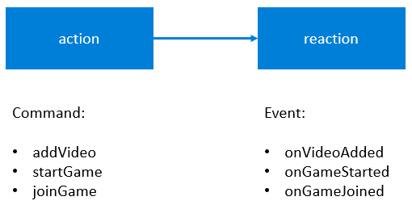
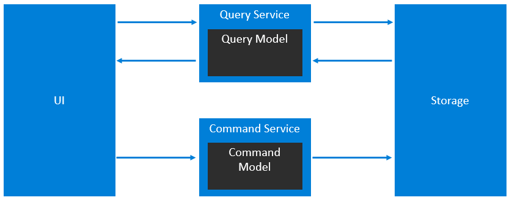
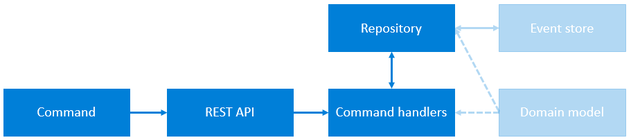

# Try not to laugh

Welcome to the Try-Not-To-Laugh repository. By reading this, we assume
you would like to contribute and help making this game better. We really appreciate that and
welcome you to do so.

But before you submit your first pull request, please read our [Contributions guidelines file](./contributing.md).

## Getting started

We rely on proven, well documented open source projects. Therefore it is important to work through the following chapters to become familiar with the projects ecosystem. If you are already familiar with the content provided in the following chapters, feel free to skip them.

### Preparation

In order to develop, build and run the application, the following preparation must be done:

1. Download the latest [Node.js](https://nodejs.org/en/) version and install it.

2. Download the latest version of [Yarn](https://yarnpkg.com/en/docs/install) and install it.

3. Checkout the repository

4. Run ```yarn install``` in the root directory of the project.

5. Run ```yarn bootstrap``` to link the packages in this repo together.

6. Place the ```.env``` you received into the root of the server package (```./packages/server```)

7. Run ```yarn start``` to start the local environment.


Platform specific:

In order to build the application, the following platform specific dependencies must be installed on your system.

>On Windows: Install the [C++ Build Tools](https://www.microsoft.com/de-de/download/details.aspx?id=48159). If you have Visual Studio installed, you don't need these.

>On MAC: Install the Xcode CLI Tools from a terminal: xcode-select --install

### Recommended IDE
Any IDE for Node.js will do the job, but most of the contributors are using [VS Code](https://code.visualstudio.com/).

Notable extensions:

- [Github](https://code.visualstudio.com/docs/editor/github)

  This extensions helps reviewing pull requests, create issues and more.

- [Code Spell Checker](https://marketplace.visualstudio.com/items?itemName=streetsidesoftware.code-spell-checker)

  Helpful to get rid of those spolling mustakes.

### Package Manager & Scripts

Familiarize yourself with the structure of Node.js projects (especially the [package.json](https://docs.npmjs.com/creating-a-package-json-file)). The web is full of tutorials and step-by-step instructions. Please use them to familiarize yourself with Node and its Package Manager. Depending on your previous knowledge, it can't hurt to create a project yourself.

In this project, we use the package manager [yarn](https://classic.yarnpkg.com/en/). Mainly because of its performance and its "workspace" feature.

So make yourself familiar with the [Yarn CLI](https://classic.yarnpkg.com/en/docs/cli/) in particular. It is used to install packages, run tests and start the application.

The goal of this chapter is to tell you that you should learn to read the package.json file and its scripts.
Once you're familiar with that, you can open the package.json file and directly see which commands you can execute via the CLI.

To get you started, the most important ones are:

```
yarn start
```
This starts the game locally on a development server.

```
yarn lint
```
This runs the Static Code Analysis.

```
yarn jest
```
This runs all Unit Tests.

I don't like to document each and every script because a) they are fairly easy to figure out and b) they change from time to time and no one thinks about the README.

### JavaScript

Yes. JavaScript. Depending on your background [read this](https://developer.mozilla.org/en-US/docs/Web/JavaScript/A_re-introduction_to_JavaScript).

### Angular
Angular is an application design framework and development platform for creating efficient and sophisticated single-page apps.

Check the [Getting started with Angular](https://angular.io/start) for more information.

### Typescript

The whole project is written in TypeScript. The TypeScript Code you will write gets transpiled (source-to-source compiled) to JavaScript with the help of Webpack (client side, and of course TypeScript).

If you are unfamiliar with Typescript, start with their excellent [Handbook](https://www.typescriptlang.org/docs/handbook/basic-types.html). Or with their [TypeScript in 5 minutes](https://www.typescriptlang.org/docs/handbook/typescript-in-5-minutes.html) guide. Or with one of their [Samples](https://www.typescriptlang.org/samples/index.html).

### Lerna
Lerna is a tool that optimizes the workflow around managing multi-package repositories with git and npm. The two primary commands in Lerna are ```lerna bootstrap``` and ```lerna publish```. ```bootstrap``` will link dependencies in the repo together. ```publish``` will help publish any updated packages.

We use ```Lerna``` to manage the different packages inside this repository. Specially we:
  - Solely use yarn workspaces for the Mono-Repo workflow
  - Use lerna’s utility commands to optimize managing of multiple packages, e.g., selective execution of npm scripts for testing.
  - Use lerna for publishing packages since lerna provides sophisticated features with its version and publish commands.

### Express
[Express](https://expressjs.com/) is the most popular Node web framework, and is the underlying library for a number of other popular Node web frameworks. It provides mechanisms to:

- Write handlers for requests with different HTTP verbs at different URL paths (routes).
- Integrate with "view" rendering engines in order to generate responses by inserting data into templates.
- Set common web application settings like the port to use for connecting, and the location of templates that are used for rendering the response.
- Add additional request processing "middleware" at any point within the request handling pipeline.

Please check the [Getting started](https://expressjs.com/en/starter/installing.html) section of the Express documentation for more information.

### Mongoose
[Mongoose](https://mongoosejs.com/) is a [MongoDB](https://www.mongodb.com/) object modeling tool designed to work in an asynchronous environment. Mongoose supports both promises and callbacks.

Please check the [Getting started](https://mongoosejs.com/docs/index.html) section of the Mongoose documentation for more information.

### Socket.IO
[Socket.IO](https://socket.io) is a JavaScript library for realtime web applications. It enables realtime, bi-directional communication between web clients and servers. It has two parts: a client-side library that runs in the browser, and a server-side library for Node.js.

Please check the [Get started](https://socket.io/get-started) section of the socket.io documentation for more information.

### Summary

This is it, you've covered all the basics to write code in all b+s Connects Redux based products. Now it's time to talk about the organizational topics.

## Project overview

We organize our code in a way to enable us to perform [Continuous Deployment](https://www.atlassian.com/continuous-delivery/continuous-deployment).

Take a moment and let this sink in. It is part of the culture in this project. We work tirelessly to shorten our release cycles, to automate cumbersome and manual tasks and to get valuable feedback as early as possible.

### Repositories

This is the Repository where our Source Code is stored. And it is organized as a [Monorepo](https://en.wikipedia.org/wiki/Monorepo). A good article called "You too can love the MonoRepo" (see https://medium.com/@Jakeherringbone/you-too-can-love-the-monorepo-d95d1d6fcebe) can be found on Medium. If you prefer a more scientific approach, you can also read the following [case study](https://people.engr.ncsu.edu/ermurph3/papers/seip18.pdf) from Google.

In addition to being a MonoRepo, we follow the [Trunk Based Development](https://trunkbaseddevelopment.com/) Model. Basically its how we worked back in the SVN days, but you still might find the [Five-minute overview](https://trunkbaseddevelopment.com/5-min-overview/) helpful. More on that model can be found in the [contribution guide](contributing.md).

Unfortunately, because of the surrounding systems, we cannot store everything in the monorepo. 

### Architecture 

#### Client
The Client consists of a classic Angular Application. If you know Angular, you will be able to read and adapt the client in almost no time.

#### Server
Our goals are to:
- Separate core business logic from implementation details
- Be independent of any database, framework or service
- Use simple pure functions whenever possible
- Make the project easy to scale “horizontally”
- Make the project easy to test
- Use type system primarily to communicate the “ubiquitous language” of the core domain

In order to reach this goal we use a simplified version of the CQRS and Event Sourcing Pattern.

In Event sourcing (ES) we can look at a system and say that there are actions and every action causes a reaction. The action, in this case, can be implemented as commands and the reactions as events.



Depending on whether these events are used for capturing a change in the system or as a source of data for reporting, the application is divided into two sides:

- **write side** (or a command side) —deals with issues of event storage, ensuring business rules and handling commands

- **read side** (or a query side) —takes events produced by the write side and uses them to build and maintain a model that is suitable for answering the client’s queries

In short, it’s a typical CQRS application where we segregate the responsibility between commands (write requests) and queries (read requests):



Even though “action causes reaction” statement is correct, it doesn’t really tell you much on how a command is created, captured or validated, how invariants (business rules) are ensured or how to deal with coupling and separation of concerns.
For this to explain it’s useful to be aware of the “big picture” upfront:



1. Command is an object sent by the user (from the UI)
2. REST API receives a command and handles user authentication
3. Command handler makes a request to a repository for the aggregate state
4. Repository retrieves events from the event store and transforms them to an aggregate state using a reducer defined in a domain model
5. Command handler validates the command on the current state of the aggregate using a domain model which responds with resulting events
6. Command handler sends resulting events to a repository
7. Repository attempts to persist received data in the event store while ensuring consistency using optimistic locking

Because this project in its current state is fairly simple, there are no Domain Models and no Event Store. As of now, we simply store the aggregated state in the MongoDB.

### Testing

While not yet fully there, we want to have 100% automated tests.

#### Static Code Analysis

We use [ESLint](https://eslint.org/) as ESLint now supports TypeScript.

You can execute ESLint by running:
```
yarn lint
or
yarn lint:fix
```

In addition we parse the results with [SonarCloud](https://sonarcloud.io/). And we take care of keeping everything at rating ```A```. And so should you.

#### Unit Testing

We use [Jest](https://jestjs.io/) to write our Unit Tests. Testing with Jest is straight forward. Please refer to the [docs](https://jestjs.io/docs/en/getting-started).

If you are writing tests for an ES Module called ```example.ts```, we place the tests in the same directory where the ES Module is and call it ```example.spec.ts```.

In addition, we write our tests in a [BDD](https://de.wikipedia.org/wiki/Behavior_Driven_Development) like manner. For example:

```
describe('Example', () => {

  describe('When the module is loaded', () => {

    it('does x', () => {});

    it('does y', () => {});

    describe('and another fact is given', () => {
      it('does z', () => {});
    });
  });
});
```

This basically reads like: "**When** the module is loaded, **and** another fact is given, **it** does z".

You can execute all tests locally by running:

```
yarn jest
```

And you can also execute just single test files by running:
```
yarn jest example
yarn jest _ModMyMod/helper/example.spec.ts
```

After running tests, you will find a coverage report in ```./coverage/lcov-report/index.html```.

While we are not yet there, we want to have 100% Coverage on new code.

### Github Actions
GitHub Actions now supports CI/CD, free for public repositories. GitHub Actions is an API for cause and effect on GitHub: orchestrate any workflow, based on any event, while GitHub manages the execution, provides rich feedback, and secures every step along the way. With GitHub Actions, workflows and steps are just code in a repository, so you can create, share, reuse, and fork your software development practices.

We use Github Actions as a CI/CD pipeline. Every Pull Request merged to the master, will be automatically deployed to production (Google Cloud Run). Feel free to check out the workflows in this repository under ```./github/workflows```. In order to get started with GitHub Actions, refer to the [Quickstart](https://docs.github.com/en/free-pro-team@latest/actions/quickstart) guide.


### Source Code Comments

Source Code Comments are important to hint other developers (or yourself after some time writing the code) why you made certain decisions.

But then there is also Uncle Bob Martin saying "A comment is a failure to express yourself in code. If you fail, then write a comment; but try not to fail.". Partially, I agree.

Therefore we don't force you to write Source Code Comments for every exported or private function and every field. We want to avoid having use less comments in the code.

But we do add Source Code Documentation to our Definitions. For example check the file ```./packages/definition/src/game/GameState.ts```. There you will see comments like:

```
/**
  * Awaiting players to join the game.
  */
Prepare: number;
```

These comments will be visible when hovering a reference in the implementation (at least in VSCode). And this is extremely helpful. Otherwise we have to provide utterly complex field names.

### Refactoring vs. Restructuring

When ever we find something bad in the code. We fix it. Especially, we:

- Add missing tests
- Fix typos
- Simplify code
- Remove duplicates 
- Move code to a logically better place
- ...

And in order to be transparent to our colleagues, we use appropriate terms which describe what we are doing. Especially, we try to use the term refactoring only when we really are refactoring. Please refer to Martin Fowlers Article [RefactoringMalapropism](https://martinfowler.com/bliki/RefactoringMalapropism.html) for further information.

### Documentation

We use web based documentation in the form of a static website generated by using [Docusaurus](https://v2.docusaurus.io/). You will find the documentation in the package ```documentation```.

### Versioning and Releases

Right now there is a change going on to automate the full release process by using [semantic-release](https://github.com/semantic-release/semantic-release) which relies on a specific commit message format called [Conventional Commits](https://www.conventionalcommits.org/en/v1.0.0/). This is the reason why the Contributing Guide is not yet available.


Once this is done, we will gain various benefits, but also tradeoffs:

1. The source of truth for our release management would be github.

    ++ Everything in one place

    -- we need to review the commit messages carefully. Fixing typos in the changelog would include building a new version. 

2. Version management is in Github and fully automated.

    ++ SemVer, all the way. No "Marketing Major" just true, transparent SemVer.

3. Adapt the way we use git

    We need to write merge commit messages following the Conventional Commits specification.

## Working together
We help each other by:
- Apply bug fixes
- Make use of code as easy as possible
- We discuss ideas and do what is best for the project

There is one solution, and we take care of it and each other.

By doing so we:
- Use welcoming and inclusive language
- Are respectful of differing viewpoints and experiences
- Graceful accept constructive criticism
- Focus on what is best for the solution
- Show empathy towards other team members
